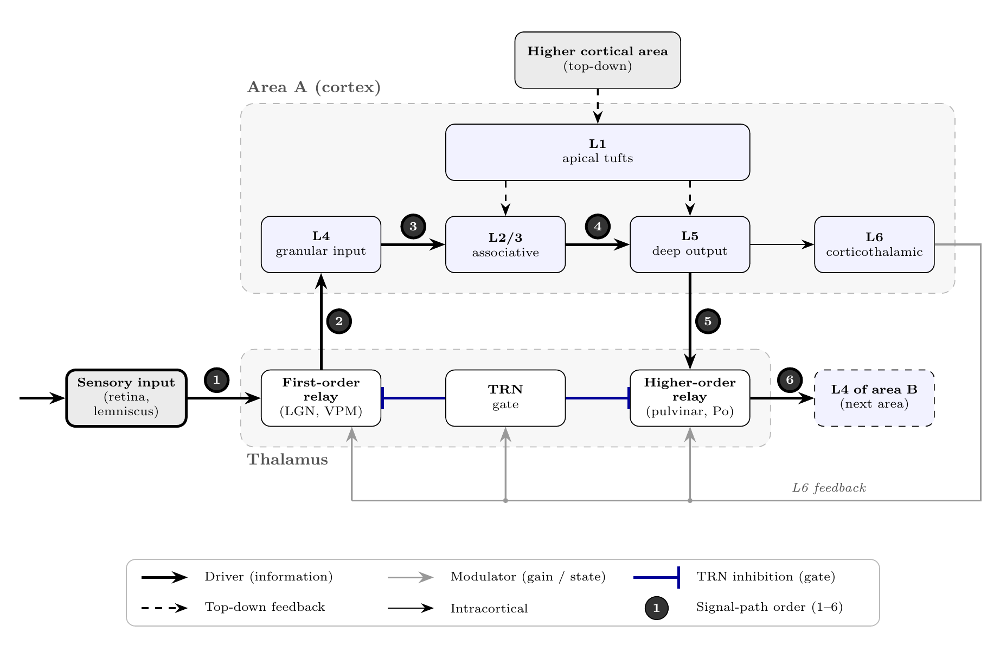

# 1 Biological Foundation

This chapter is the biological foundation of the circuit that the model developed in this thesis follows—the neocortical microcircuit and the cortico-thalamo-cortical loop in which it is integrated. The account is canonical rather than exhaustive—it describes the organization that recurs across cortical areas rather than the full quantitative detail of any one—and it is drawn principally from sensory neocortex, where the underlying anatomy and physiology are most fully characterized. It rests on a small set of established sources: White [1] and the *Handbook of Brain Microcircuits* [2] for cortical structure, Douglas, Martin, and Whitteridge [3] and Douglas and Martin [4] for the canonical microcircuit, Rudy et al. [5] for the inhibitory cell classes, and Sherman and Guillery [6, 7] for the thalamus and its cortical connections.

The chapter is deliberately confined to biology described on its own terms. It identifies the layers, cell types, and connections of the circuit, the direction and character of the information flow through it, and the distinct roles of its inhibitory and thalamic elements, but it does not map any of these onto components of the computational model. That correspondence is deferred to the bridge chapter. The separation is methodological, not presentational: the biology must stand as an independent description if the model is later to be evaluated against it, rather than being cast in whatever terms most flatter the model.

The unit of description is a single cortical column together with the thalamic circuitry to which it is reciprocally connected. The treatment stays at the level of cell classes and their connectivity; developmental origin, synaptic plasticity, and neuromodulation enter only where they bear directly on the circuit's operation—for instance, in the control of thalamic firing mode. Where the canonical picture has since been refined or contested, this is noted rather than absorbed, so that the account remains anchored to the framework the rest of the thesis depends on.

The chapter proceeds from structure to circuit to loop: the laminar organization of the neocortex (Section 1.1), its excitatory principal neurons (Section 1.2) and inhibitory interneurons (Section 1.3), the canonical intracolumnar microcircuit that links them (Section 1.4), the thalamus and its relay and gating apparatus (Section 1.5), and the cortico-thalamo-cortical loop that binds cortex and thalamus into one processing system (Section 1.6), summarized in an integrative circuit diagram (Section 1.7).

## 1.1 Laminar organization of the neocortex

The defining structural feature of the neocortex is its organization into horizontal layers, or laminae, stacked between the pial surface and the underlying white matter. The layers are distinguished cytoarchitecturally—by the size, packing density, and type of their constituent neurons—rather than by sharp anatomical borders, and the conventional scheme recognizes six of them, numbered L1 to L6 from the pia inward [1, 2]. This laminar scheme is most sharply expressed in primary sensory cortex, the granular or koniocortical type, in which the input layer is especially prominent; in agranular cortex, such as primary motor cortex, that layer is thin or absent. The canonical account developed here, and the sources it rests on, are drawn principally from granular sensory cortex, where the layers and their connections are most fully characterized.

The superficial layers occupy the outermost cortex. Layer 1 is a cell-sparse zone dominated not by somata but by neuropil: the apical dendritic tufts of pyramidal cells whose bodies lie in deeper layers, together with horizontally running axons, among them the terminals of long-range feedback projections from higher cortical areas. It contains only a sparse population of inhibitory neurons and no excitatory somata to speak of, and functionally it is best understood as the principal termination zone for top-down input onto the distal dendrites of pyramidal cells [2]. Beneath it, layers 2 and 3—frequently treated together as the supragranular compartment—are populated by small and medium pyramidal cells and form the associative tier of the cortex; they are the main origin of the feedforward corticocortical projections that carry a cortical area's output to the next area in the hierarchy [4].

Layer 4 is the granular input layer. It is densely packed with small excitatory neurons, and it is the principal cortical target of the ascending thalamocortical afferents that convey sensory information to the cortex [1, 4]. Its prominence is what distinguishes granular sensory cortex, and its role as the point of entry for thalamic input makes it the anchor of the layered scheme: layers are conventionally grouped by their position relative to it, as supragranular (L1–L3), granular (L4), and infragranular (L5–L6).

The deep, infragranular layers are the cortex's principal output stage. Layer 5 contains the largest pyramidal cells in the cortex and is the major source of long-range projections to subcortical targets; it also projects to the thalamus, in a manner distinct from that of layer 6 and taken up in Section 1.6. Layer 6 is the corticothalamic layer proper: it is the origin of the numerically dominant descending projection back to the thalamus, and it also sends axons locally upward toward layer 4 [2, 6]. Together the deep layers return the results of cortical processing to subcortical structures and, critically for this thesis, close the loop with the thalamus.

This horizontal lamination is only one axis of cortical organization. Cutting across it is the vertical, or radial, dimension: the apical dendrites of pyramidal cells and the predominantly vertical interlaminar axons bind neurons across all six layers into the columnar unit that was taken as the object of description at the outset of this chapter. Lamination specifies what each layer is and where it sits; the directed flow of activity between the layers—the canonical microcircuit—is the subject of Section 1.4, after the cell types that populate the layers have been introduced in Sections 1.2 and 1.3.

## 1.2 Excitatory principal neurons

The large majority of cortical neurons, on the order of 80%, are excitatory, glutamatergic cells, and the principal type among them is the pyramidal cell [1, 2]. Its morphology is stereotyped and functionally consequential: a roughly pyramid-shaped soma gives rise to a skirt of basal dendrites near the cell body, a set of oblique dendrites, and a single prominent apical dendrite that ascends toward the pial surface and terminates in a branching tuft in layer 1. The dendrites are densely studded with spines, the principal sites of excitatory input, and the axon projects both locally, within and across layers of the same column, and, for many pyramidal cells, over long range to other cortical areas or subcortical targets. Pyramidal cells are found in every layer except layer 1, and it is the layer of the soma that largely determines a cell's projection target, as set out below.

The pyramidal cell's dendritic geometry segregates its inputs into two functionally distinct streams. Feedforward input—ascending from lower cortical areas and, in the input layer, from the sensory thalamus—arrives predominantly on the basal and perisomatic dendrites, electrotonically close to the soma and the site of action-potential initiation. Feedback input from higher cortical areas arrives instead on the apical tuft in layer 1, electrotonically remote from the soma. Because the apical tuft is separated from the perisomatic region by the long apical trunk, the two streams are not simply summed: the distal compartment supports its own regenerative events, and near-coincident activation of the perisomatic and apical compartments can trigger dendritic calcium spikes that switch the cell into burst firing [8]. The pyramidal cell is therefore not a simple integrator but a two-compartment device that can register the coincidence of bottom-up and top-down signals—a property whose circuit context is developed in Sections 1.4 and 1.6.

The projection target of a pyramidal cell is characteristic of its layer. Cells in layers 2 and 3 are the principal source of feedforward corticocortical output, projecting to the next area in the cortical hierarchy while also contributing dense recurrent connections within the local circuit [4]. Layer 5 contains two broad classes: intratelencephalic cells, which project to other cortical areas and to the striatum, and the large, thick-tufted pyramidal-tract cells, which project to subcerebral structures and, through axon collaterals, supply driving input to higher-order thalamic nuclei [2, 6]. Cells in layer 6 include the corticothalamic pyramidal cells that form the numerically dominant descending projection to the thalamus, alongside cells projecting corticocortically and axons ascending locally to layer 4 [2]. The distinct thalamic roles of the layer-5 and layer-6 projections are the subject of Section 1.6.

Not all excitatory neurons are pyramidal. Layer 4 contains, in addition to small pyramidal cells, a population of spiny stellate cells: excitatory, spine-bearing neurons that lack a prominent apical dendrite and whose dendrites instead radiate locally around the soma [1, 4]. They are a specialization of the input layer, receiving thalamocortical afferents directly and distributing that input locally within the column, and they are most numerous in the primary sensory areas where the granular layer is best developed. Functionally they can be regarded as the first cortical recipients of the ascending sensory message, a role taken up in the description of the canonical microcircuit in Section 1.4.

With the excitatory principal neurons and their two input streams established, the remaining cellular component of the column is the inhibitory interneuron population, which is small in number but decisive in shaping how the excitatory cells integrate these streams. It is described next, in Section 1.3.

## 1.3 Inhibitory interneurons

The remaining fifth or so of cortical neurons are inhibitory, GABAergic interneurons. Though a numerical minority, they are not a homogeneous population: they fall into a small number of largely non-overlapping classes, each distinguished by the molecular markers it expresses, the firing pattern it exhibits, and, most consequentially for the circuit, the subcellular compartment of the pyramidal cell it innervates [5, 9]. This last property is the organizing principle of this section: the principal interneuron classes divide the pyramidal cell between them, one governing the perisomatic region where output is generated and another governing the distal dendrites where the two input streams of Section 1.2 are received, so that inhibition is not a single global quantity but a compartment-specific control.

Three molecularly defined classes account for nearly the entire interneuron population: cells expressing parvalbumin (PV, roughly 40%), cells expressing somatostatin (SST, roughly 30%), and cells expressing the ionotropic serotonin receptor 5HT3aR (roughly 30%) [5]. The three classes are essentially non-overlapping, and together they exhaust the inhibitory population to a first approximation. The four components named in the scope of this chapter—PV, SST, VIP, and the interneurons of layer 1—map onto this scheme as follows: PV and SST are the first two classes, while VIP cells and the layer-1 interneurons are two functionally distinct subgroups of the third, the 5HT3aR class, as set out below.

PV cells are fast-spiking and target the perisomatic region of the pyramidal cell: the two morphological types are the basket cells, which innervate the soma and proximal dendrites, and the chandelier, or axo-axonic, cells, which innervate the axon initial segment itself [9]. Because they act at or near the site of action-potential initiation, PV cells are positioned to control the pyramidal cell's spike output directly—its gain and its timing—rather than the integration of its inputs; their fast kinetics and dense, relatively non-selective local connectivity also make them the principal substrate of fast network synchronization in the gamma band [9]. SST cells, by contrast, target the distal dendrites. The archetype is the Martinotti cell, whose ascending axon ramifies in layer 1 among the apical tufts of pyramidal cells [9]; SST inhibition therefore acts on the compartment that receives top-down feedback, and is positioned to control dendritic integration and the regenerative dendritic events described in Section 1.2 rather than somatic output.

The 5HT3aR class contains the remaining two components. VIP cells, expressing vasoactive intestinal peptide, are the disinhibitory element of the circuit: rather than targeting pyramidal cells directly, they preferentially inhibit other interneurons—SST cells above all, and PV cells to a lesser degree—so that their activation releases the pyramidal cell, and specifically its dendrites, from inhibition [9]. This VIP→SST→pyramidal motif is the canonical disinhibitory pathway by which long-range and neuromodulatory inputs, which contact VIP cells, can open the dendritic compartment to feedback. The layer-1 interneurons form the other, non-VIP part of the 5HT3aR class; the most abundant type is the neurogliaform cell, which releases GABA diffusely by volume transmission rather than at conventional one-to-one synapses, producing slow, spatially broad inhibition (including through GABAB receptors) onto the apical tufts in layer 1 [9]. Functionally they are the inhibitory counterpart of the feedback that terminates in layer 1.

A caution is needed on what this compartmental division of labour does and does not establish. The synaptic targeting itself—PV to the perisomatic region, SST to the distal dendrites—is robust and is the property this chapter relies on. The further step of assigning each class a fixed arithmetic operation on the pyramidal cell's input-output function, PV acting divisively and SST subtractively, is often made but is not settled: activating either class has been shown to produce mixtures of divisive and subtractive effects, and threshold nonlinearities interacting with recurrent network activity can convert subtractive inhibition of single neurons into divisive inhibition at the network level, or the reverse [10]. This chapter therefore characterizes the interneuron classes by their synaptic targeting and their consequent control of the output versus the input compartment, and does not commit to a fixed arithmetic label; the computational interpretation of these operations is taken up where the model is introduced.

With the excitatory and inhibitory cell types in hand, the layers they populate can now be connected into a directed circuit. Section 1.4 assembles the canonical intracolumnar microcircuit, and the interneuron classes described here reappear there as the compartment-specific controllers of its excitatory flow.

## 1.4 The canonical intracolumnar microcircuit

The layers and cell types described so far are bound into a directed circuit whose principal features recur across cortical areas and species. This recurring pattern of interlaminar connectivity is the canonical microcircuit, abstracted by Douglas, Martin, and Whitteridge [3] and developed by Douglas and Martin [4]: despite the areal diversity of the cortex, the dominant excitatory pathways between the layers follow a stereotyped template, which serves here as the organizing description of intracolumnar flow.

The template has a characteristic feedforward spine. Ascending thalamocortical afferents deliver their input principally to layer 4, whose excitatory neurons project upward to the supragranular layers 2 and 3. Layers 2/3 in turn project to layer 5, and layer 5 to layer 6, so that the dominant axonal pathway runs thalamus → L4 → L2/3 → L5 → L6 [4, 1]. The infragranular layers constitute the circuit's output stage—layer 5 to subcortical and higher-order thalamic targets, layer 6 back to the thalamus (Section 1.6)—while layer 6 also sends axons locally upward to layer 4, providing one intracolumnar feedback limb of the loop [2]. This serial spine, from granular input through supragranular association to infragranular output, is the sense in which the column "processes" its input.

A feature of the canonical circuit that is easily missed, but is central to how it operates, is that the feedforward afferent is not the numerically dominant input at any stage. The thalamocortical projection accounts for only a small fraction of the excitatory synapses onto its layer-4 target neurons; the overwhelming majority of excitatory synapses in the column originate from other cortical neurons, both within a layer and between layers [4]. The circuit is therefore dominated by recurrent, intracortical excitation rather than by the afferent it relays: the thalamic input is better understood as igniting a recurrent cortical process than as being passively passed along. This recurrent character—a small driving input amplified and shaped by dense local feedback—is the property that makes the column a computational unit rather than a relay, and it is the aspect of the biology most directly relevant to the recurrent architecture the rest of this thesis develops.

The inhibitory interneurons of Section 1.3 are woven into this excitatory template at every stage. In the input layer, thalamocortical afferents contact PV cells as well as excitatory neurons, so that thalamic drive arrives with a brief lag of perisomatic feedforward inhibition that sharpens the timing and gain of the layer-4 response. More generally, because each excitatory projection is accompanied by the compartment-specific inhibition described earlier—perisomatic from PV cells, dendritic from SST cells, disinhibitory gating from VIP cells—the flow along the spine is everywhere shaped by the balance of excitation and inhibition rather than by excitation alone [9].

This canonical picture is an abstraction, and two qualifications on it should be stated rather than absorbed silently. First, the strictly serial reading in which all cortical activity must pass through layer 4 before reaching the deep layers is now known to be incomplete: deep-layer neurons receive sensory-evoked input directly from the thalamus, at the same latency as layer 4 and persisting when layer 4 is silenced, so that the thalamus drives an upper (L4, L2/3) and a lower (L5/6) stratum in parallel rather than purely in series [11]. Second, quantitative and optogenetic studies have refined several of the interlaminar projections of the template, including the targets of the layer-6 projection and the contribution of translaminar inhibition, beyond the resolution of the original abstraction. This chapter adopts the canonical microcircuit as the backbone description of intracolumnar flow because it remains the shared framework the thesis depends on, while treating these refinements as established qualifications to it rather than replacing the backbone with them.

The circuit described so far is intracortical: it ends where the column's output leaves it. But that output does not simply exit—much of it returns to the thalamus, and the thalamus returns signals to the cortex, so that the column is one stage of a larger re-entrant loop. The thalamus, its relay and gating apparatus, and the two descending projections that close this loop are the subject of Sections 1.5 and 1.6.

## 1.5 The thalamus: relay, drivers and modulators, and gating

Every ascending pathway to the neocortex passes through the thalamus, and much of the cortex's output returns to it, so the thalamus is at once the cortex's obligatory gateway and its re-entrant partner. It is not, however, the passive relay this position might suggest: what it transmits to the cortex is continuously gated and shaped by other inputs, and characterizing that gating is the purpose of this section. Three neuronal populations carry it out. Thalamocortical relay cells are the projection neurons that send the thalamic message to the cortex; local GABAergic interneurons provide inhibition within certain nuclei, though their prevalence varies with nucleus and species; and the thalamic reticular nucleus (TRN), a sheet of GABAergic cells wrapped around the thalamus, provides the principal inhibitory control over the relay cells [7, 2].

The organizing distinction for the entire thalamic circuit, due to Sherman and Guillery [6], is between two kinds of excitatory input: drivers and modulators. A driver is the input that carries the message to be relayed—the one that determines the receptive-field properties of its target cell. Drivers form large synaptic terminals on the proximal dendrites of relay cells, produce large all-or-none excitatory postsynaptic potentials that depress on repeated activation, and act through ionotropic glutamate receptors alone. A modulator, by contrast, does not constitute the message but adjusts how it is transmitted—the gain of transmission and the response mode of the relay cell. Modulators form small terminals on distal dendrites, produce small graded potentials that facilitate on repeated activation, and engage metabotropic as well as ionotropic receptors. A defining and initially counter-intuitive feature of this scheme is that the driver is numerically a minority input: in the lateral geniculate nucleus, for example, the retinal driver afferents form only a small fraction of the synapses onto relay cells, the remainder being modulatory [6, 7]. As in the cortex, then, the input that carries the information is powerful but sparse, while the inputs that set the terms of transmission are numerous.

This distinction furnishes a functional classification of thalamic relays according to the source of their driver. A first-order relay receives its driving input from a subcortical, ascending source and transmits, to the cortex, information that the cortex has not yet seen: the lateral geniculate nucleus, driven by the retina, and the ventral posterior nucleus, driven by the medial lemniscus, are the canonical examples. A higher-order relay instead receives its driving input from the cortex itself—specifically from layer 5 of one cortical area—and relays it onward to another cortical area; the pulvinar, the posterior medial nucleus, and the mediodorsal nucleus are examples [7]. The two therefore occupy different positions in the flow of cortical processing: first-order relays are entry points for new sensory information, whereas higher-order relays carry information between cortical areas by a route that passes through the thalamus. The corticothalamic projections that establish this difference, and the transthalamic pathway it implies, are the subject of Section 1.6.

What the modulatory inputs principally control is the response mode of the relay cell, and with it the gate through which driver information passes. Relay cells operate in two modes, set by the state of a low-threshold, T-type calcium conductance: a tonic mode, in which the cell transmits its driver input faithfully and more or less linearly, and a burst mode, in which the cell responds to driver input with stereotyped high-frequency bursts that no longer track it faithfully [6, 7]. The switch between these modes is one of the main things modulatory inputs accomplish, and the TRN is central to it: its GABAergic cells receive excitatory collaterals both from thalamocortical relay axons and from descending corticothalamic axons as they pass through, and they return inhibition to the relay cells, so that the TRN sits in a position to gate and, according to the balance of its activation, to switch the mode of the relay it surrounds [7, 2]. Thalamic transmission is thus a controlled variable rather than a fixed conductance: the same driver input reaches the cortex or does not, faithfully or as a burst, according to the state imposed on the relay.

The thalamus described here is therefore a gate whose setting is determined largely by its modulatory inputs. Chief among those inputs, and not yet accounted for, are the two descending projections from the cortex itself—one modulatory and one driving—which together make the thalamus not merely an input gateway but a stage within a re-entrant cortico-thalamo-cortical loop. Those projections, the transthalamic route they create, and the closure of the loop are the subject of Section 1.6.

## 1.6 The cortico-thalamo-cortical loop

The thalamus of Section 1.5 is a gate whose setting is largely determined by descending input from the cortex. That descending input is not of one kind. The cortex projects to the thalamus through two anatomically and physiologically distinct pathways, originating in two different layers and belonging to the two different classes of Section 1.5: a modulatory feedback projection from layer 6, and a driving feedforward projection from layer 5 [6, 7]. The distinction between them is the organizing principle of the whole loop, and the asymmetry in their targets is what separates first-order from higher-order relays.

The layer-6 projection is the corticothalamic feedback proper, and it has all the marks of a modulator. It is numerically massive—each relay cell is contacted by many layer-6 fibers—yet each contact is weak: small terminals on the distal dendrites of relay cells, producing small excitatory potentials that facilitate on repeated activation and engage metabotropic glutamate receptors [7, 2]. Its collaterals also innervate the corresponding sector of the TRN, so that layer 6 acts on the relay both directly and through the inhibitory nucleus that gates it. Every thalamic relay, first-order and higher-order alike, receives this layer-6 modulation; for a first-order relay it is the sole cortical input. Functionally, layer 6 does not tell the relay what to transmit but sets how it transmits—the gain of the relay and, through its influence on firing mode and on the TRN, whether the driver passes in tonic or burst form.

The layer-5 projection is of the opposite character and has a restricted target. It contacts only higher-order relays, and there it is a driver: large terminals on proximal dendrites, producing large all-or-none potentials that depress on repeated activation and act through ionotropic receptors alone, with a terminal morphology resembling that of a primary sensory afferent [7]. Unlike the layer-6 axons, it does not send collaterals to the TRN on its way. This projection is best understood not as feedback but as the column's output re-entering the thalamus as a fresh driving message: the result of one area's cortical computation, handed to a higher-order relay to be transmitted onward.

The consequence is a route by which cortical areas communicate through the thalamus, in parallel with their direct corticocortical connections. In this transthalamic pathway, layer 5 of one cortical area drives a higher-order relay, which in turn drives layer 4 of a second area; both legs are driver connections, so the message that passes is a genuine information-bearing signal rather than a modulatory adjustment [12, 7]. Because it passes through a thalamic relay, this corticocortical message is subject to exactly the same gating—TRN inhibition, tonic versus burst mode—as ascending sensory information is. The direct corticocortical connections that run alongside it, including the top-down feedback that terminates on the apical tufts in layer 1 (Section 1.2), form the loop's other descending limb; whether these direct projections act as drivers or modulators is not fully resolved and is left open here [6].

These elements compose a single re-entrant circuit, which can now be traced in full. A driving input—subcortical for a first-order relay—reaches the relay cells and, gated by the TRN and by the cell's firing mode, ascends to drive layer 4 of the cortical column. Within the column, the canonical microcircuit of Section 1.4 processes this input through its recurrent laminar flow, combining it with the top-down feedback arriving at the apical tufts. The column then returns two descending signals of the two distinct kinds: layer 6 sends a modulatory projection back to the relay that supplied its input, and to the matched TRN sector, adjusting the gain and mode of that relay for what follows; and layer 5 sends a driving projection to a higher-order relay, which transmits the column's output onward to the next area, where the same operations repeat. Ascending drive and descending modulation are thus carried by anatomically and kinetically separate pathways, and every passage through the thalamus in either direction is gated. This separation of driving from modulatory signaling, running in both directions around a thalamo-cortical loop, is the central architectural feature of the biology this chapter has described.

The whole of this circuit—its layers and cells, the direction and class of each connection, and the two gated directions of the loop—is summarized in the integrative diagram of Section 1.7.

## 1.7 Integrative circuit diagram

*Figure 1.1: The cortico-thalamo-cortical loop and the canonical cortical column, traced as a numbered flow. (1) Sensory input reaches a first-order relay, which (2) drives layer 4. (3–4) The column processes it through the canonical intracolumnar flow (L4 → L2/3 → L5); layer 5 also projects to layer 6 (thin, intracortical). (5–6) Layer 5 sends a driving projection to a higher-order relay, which drives layer 4 of the next cortical area (the transthalamic route). In parallel, layer 6 returns a modulatory projection (thin grey) to both relays and the TRN, the TRN gates both relays (blue, bar-ended), and top-down feedback from a higher cortical area reaches the apical tufts of L2/3 and L5 pyramidal cells in layer 1 (dashed). The relays' collateral input to the TRN is omitted for clarity. Connection classes follow Sherman and Guillery [6, 7].*

## Bibliography

[1] Edward L. White. *Cortical Circuits: Synaptic Organization of the Cerebral Cortex.* Boston: Birkhäuser, 1989.

[2] Gordon M. Shepherd and Sten Grillner, eds. *Handbook of Brain Microcircuits.* 2nd ed. New York: Oxford University Press, 2018.

[3] Rodney J. Douglas, Kevan A. C. Martin, and David Whitteridge. "A Canonical Microcircuit for Neocortex." *Neural Computation* 1.4 (1989), pp. 480–488.

[4] Rodney J. Douglas and Kevan A. C. Martin. "Neuronal Circuits of the Neocortex." *Annual Review of Neuroscience* 27 (2004), pp. 419–451.

[5] Bernardo Rudy et al. "Three Groups of Interneurons Account for Nearly 100% of Neocortical GABAergic Neurons." *Developmental Neurobiology* 71.1 (2011), pp. 45–61.

[6] S. Murray Sherman and R. W. Guillery. "On the Actions That One Nerve Cell Can Have on Another: Distinguishing 'Drivers' from 'Modulators'." *Proceedings of the National Academy of Sciences* 95.12 (1998), pp. 7121–7126.

[7] S. Murray Sherman and R. W. Guillery. *Functional Connections of Cortical Areas: A New View of the Thalamus.* Cambridge, MA: MIT Press, 2013.

[8] Matthew E. Larkum. "A Cellular Mechanism for Cortical Associations: An Organizing Principle for the Cerebral Cortex." *Trends in Neurosciences* 36.3 (2013), pp. 141–151.

[9] Robin Tremblay, Soohyun Lee, and Bernardo Rudy. "GABAergic Interneurons in the Neocortex: From Cellular Properties to Circuits." *Neuron* 91.2 (2016), pp. 260–292.

[10] Bryan A. Seybold et al. "Inhibitory Actions Unified by Network Integration." *Neuron* 87.6 (2015), pp. 1181–1192.

[11] Christine M. Constantinople and Randy M. Bruno. "Deep Cortical Layers Are Activated Directly by Thalamus." *Science* 340.6140 (2013), pp. 1591–1594.

[12] S. Murray Sherman and R. W. Guillery. "Distinct Functions for Direct and Transthalamic Corticocortical Connections." *Journal of Neurophysiology* 106 (2011), pp. 1068–1077.